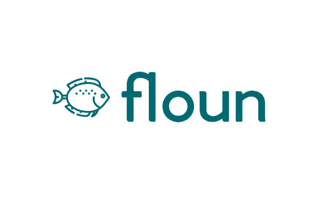

# Floun - Quantum-Resistant Protocol Analyzer



Floun is a browser extension designed to scan websites for cryptographic vulnerabilities and prepare them for the quantum computing era. By identifying weak encryption methods and recommending quantum-resistant alternatives, Floun helps users future-proof their digital infrastructure.

## Table of Contents
- [Features](#features)
- [Installation](#installation)
- [Usage](#usage)
- [Permissions](#permissions)
- [Contributing](#contributing)
- [License](#license)
- [Acknowledgments](#acknowledgments)
- [Contact](#contact)
- [Roadmap](#roadmap)

## Features
- **Comprehensive Scanning**: Detects weak encryption protocols, certificates, and security flaws.
- **Real-Time Analysis**: Provides instant feedback on a website’s security posture.
- **Quantum-Resistant Suggestions**: Recommends modern cryptographic solutions to future-proof systems.
- **User-Friendly Interface**: Simple, intuitive design with one-click scanning.
- **Open Source**: Transparent, community-driven, and adaptable to future advancements.

## Installation

### Chrome Web Store (still pending review)
1. Visit the Floun extension page on the Chrome Web Store.
2. Click **Add to Chrome**.
3. Confirm the installation by clicking **Add Extension**.

### Manual Installation
1. Download the latest release from the GitHub repository.
2. Extract the ZIP file to a folder on your computer.
3. Open Chrome and go to `chrome://extensions/`.
4. Enable **Developer Mode** (toggle in the top-right corner).
5. Click **Load unpacked** and select the folder where you extracted the extension.

## Usage

### Scan a Website:
1. Click the **Floun** icon in the Chrome toolbar.
2. Click **Scan** to analyze the currently active website.

### View Results:
- Floun will display a report of cryptographic vulnerabilities and recommendations.

### Save or Export:
- Save the report as a **PDF** or export it for further analysis.

## Permissions
Floun requires the following permissions to function:

- `activeTab`: To analyze the cryptographic protocols of the currently active website.
- `scripting`: To inject scripts for scanning and analysis.
- `storage`: To save user preferences and scan results locally.
- `host permissions`: To access and scan websites for vulnerabilities.

## Privacy Policy
Floun is committed to protecting your privacy. Here’s what you need to know:

- **Data Collection**: Floun does not collect or store any personal data. The extension only analyzes cryptographic protocols and certificates on websites visited by the user.
- **Permissions**:
  - `activeTab`: Used to analyze the cryptographic protocols of the currently active website.
  - `scripting`: Used to inject scripts for scanning and analysis.
  - `storage`: Used to save user preferences and scan results locally.
- **Data Storage**: All data is stored locally on the user’s device and is not shared with any third parties.


## Contributing
We welcome contributions from the community! Here’s how you can help:

- **Report Issues**: If you find a bug or have a feature request, please open an issue here.
- **Submit Pull Requests**: Fork the repository, make your changes, and submit a pull request.
- **Spread the Word**: Share Floun with your network and help us grow the community.

### Development Setup
#### Clone the repository:
```bash
git clone https://github.com/your-repo/floun.git
```
#### Install dependencies:
```bash
npm install
```
#### Build the extension:
```bash
npm run build
```
#### Load the extension in Chrome:
1. Go to `chrome://extensions/`.
2. Enable **Developer Mode**.
3. Click **Load unpacked** and select the `dist` folder.

## License
Floun is not yet licensed as of now.

## Acknowledgments
- **NIST**: For their work on post-quantum cryptography standards.
- **OpenSSL**: For providing the tools to analyze cryptographic protocols.
- **The Cybersecurity Community**: For their ongoing efforts to make the digital world safer.

## Contact
For questions, feedback, or support, please contact us:

- **Email**: [ngaoyu27@gmail.com](mailto:ngaoyu27@gmail.com)


## Roadmap

### Short-Term:
- Add support for network-level scanning.
- Integrate with popular cybersecurity frameworks.

### Long-Term:
- Expand to other browsers (e.g., Firefox, Edge).
- Develop a standalone application for enterprise use.

Thank you for using Floun! Together, we can build a safer, more secure digital future.
