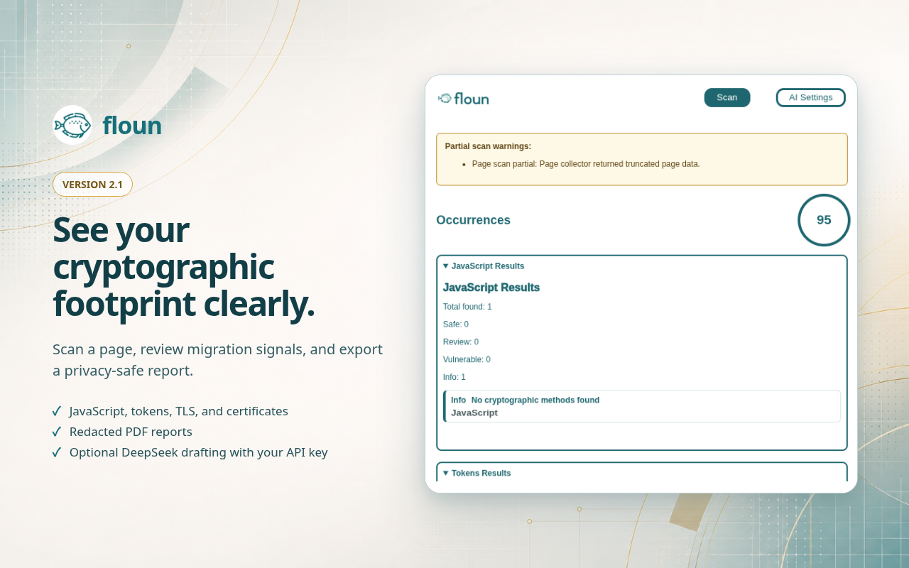

# Floun

[](https://github.com/platypus27/floun/actions/workflows/release-check.yml)
[](https://github.com/platypus27/floun/actions/workflows/codeql.yml)
[](LICENSE)
[](docs/RELEASE_NOTES_3.0.0.md)

Floun is an open-source Chrome extension that maps browser-visible cryptography signals for migration planning. It scans only when requested, explains what it found, redacts sensitive evidence, and exports a focused PDF report.



## Why Floun?

Post-quantum migration starts with understanding where cryptography appears and how confidently it can be classified. Floun provides a lightweight inventory from the browser surface without pretending to replace a security assessment.

- Scan the current HTTP or HTTPS tab on demand.
- Review JavaScript patterns, session-token heuristics, TLS metadata, and certificate signatures.
- Separate known weak cryptography from migration-review and informational signals.
- Inspect rationale, confidence, limitations, recommendations, rule identifiers, and references.
- Export a PDF with redacted evidence.
- Optionally draft report sections with a user-owned DeepSeek API key and explicit consent.

The complete popup uses the Kryv Labs [`@kryv/teal`](https://www.npmjs.com/package/@kryv/teal) design system.

## Status

Floun 3.0.0 is the current release candidate. Repository tests, packaging, artifact validation, deterministic builds, store assets, and real Chrome popup flows are verified locally. Chrome Web Store publication and rollout are separate operational steps.

See the [3.0.0 release notes](docs/RELEASE_NOTES_3.0.0.md) and [QA evidence](docs/release/3.0.0/QA_EVIDENCE.md).

## Install from source

Requirements:

- Node.js 22 or newer
- npm 10 or newer
- Chrome or a compatible Chromium browser

```bash
git clone https://github.com/platypus27/floun.git
cd floun/floun
npm ci
npm run build
```

Then open `chrome://extensions/`, enable Developer Mode, choose **Load unpacked**, and select `floun/build/`.

## Development

The extension application lives under `floun/`.

```bash
cd floun
npm ci
npm run test
npm run lint
npm run typecheck
npm run build
```

The main local quality gate is:

```bash
npm run release:check
```

To serve the safe synthetic scan fixture:

```bash
npm run fixture:server
```

Then scan `http://127.0.0.1:4174/crypto-readiness.html`.

## Architecture

Floun is a Manifest V3 extension with four main boundaries:

1. The React popup starts user-driven scans and renders results using Teal components.
2. A typed scan client sends a minimized target to the background service worker.
3. Background adapters collect bounded page evidence and request TLS and certificate metadata from SSL Labs.
4. Analysis modules classify findings locally, while report services redact evidence before PDF export or optional DeepSeek drafting.

There is no always-on content script. The optional DeepSeek API key and consent state are stored in device-local extension storage, never Chrome Sync. See [Architecture](docs/ARCHITECTURE.md) for module and data-flow details.

## Privacy and security

Floun removes credentials, paths, queries, and fragments before sending the scan target to the background worker. Browser-visible token evidence is redacted before display and omitted from AI prompts. DeepSeek is contacted only when a user supplies an API key and explicitly consents.

- [Privacy policy](docs/store/PRIVACY_POLICY.md)
- [Security policy and private reporting](SECURITY.md)
- [Chrome Web Store privacy disclosures](docs/store/CHROME_WEB_STORE_PRIVACY.md)

Never include API keys, credentials, raw tokens, or private browsing data in public issues.

## Limitations

Floun is not a definitive vulnerability scanner or a replacement for code review, dependency analysis, infrastructure inventory, penetration testing, or professional cryptographic assessment.

The extension does not inspect every endpoint, dependency, authorization rule, cookie flag, server-side session control, or application data flow. Browser-visible findings can be incomplete or contextual and should be validated with application and infrastructure owners before remediation decisions.

## Contributing

Contributions are welcome. Start with [Contributing](CONTRIBUTING.md), use the structured issue forms, and follow the [Code of Conduct](CODE_OF_CONDUCT.md).

- [Roadmap](ROADMAP.md)
- [Support](SUPPORT.md)
- [Governance](GOVERNANCE.md)
- [Security](SECURITY.md)

## Releases

From `floun/`:

```bash
npm run release:ready
npm run qa:chrome:flows
npm run release:publish:check
```

Release artifacts are generated locally under `floun/release/` and are not committed. Official releases should be built from a signed version tag and published with checksums after all gates pass.

## License

The source code is available under [Apache-2.0](LICENSE). The Floun and Kryv Labs names and brand assets are governed by the [Trademark Policy](TRADEMARKS.md).

Copyright 2026 Kryv Labs.
